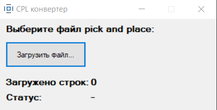
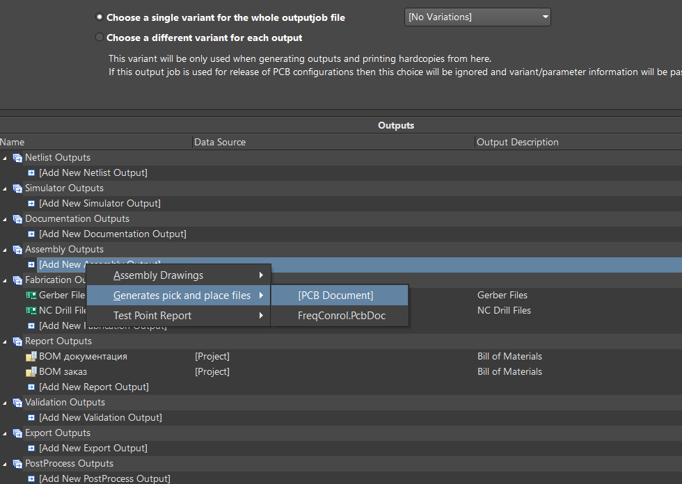
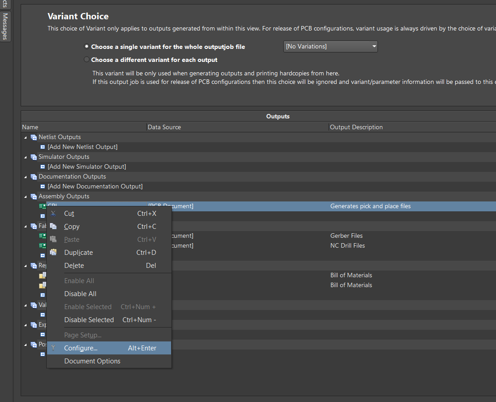
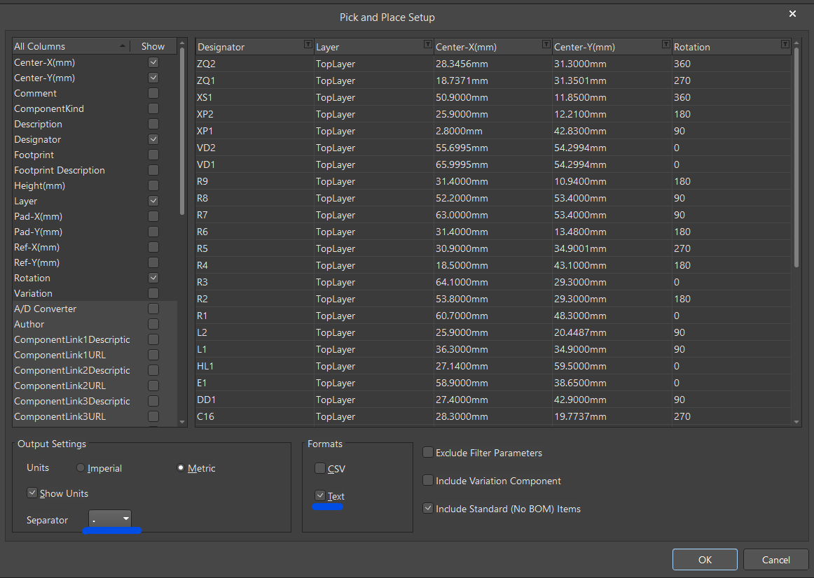
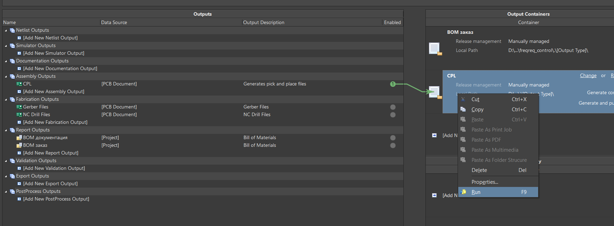
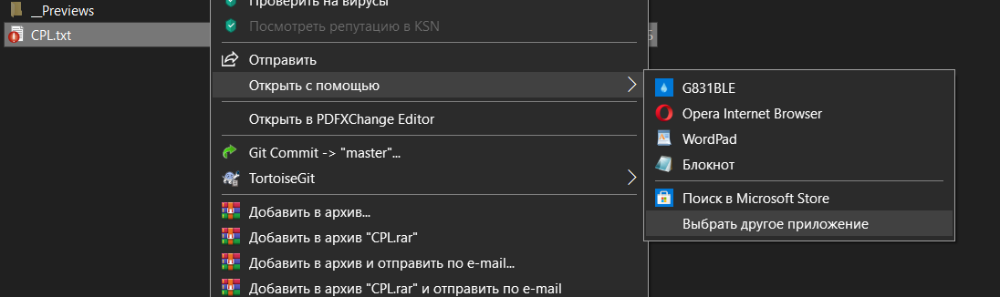
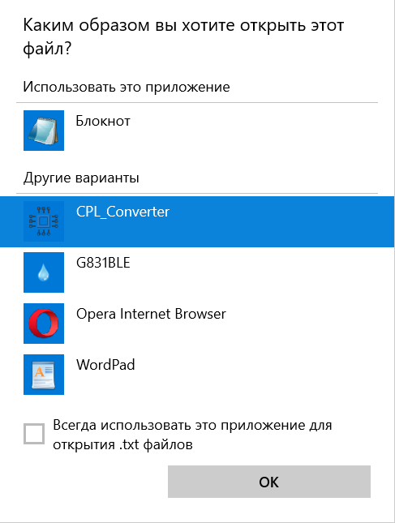
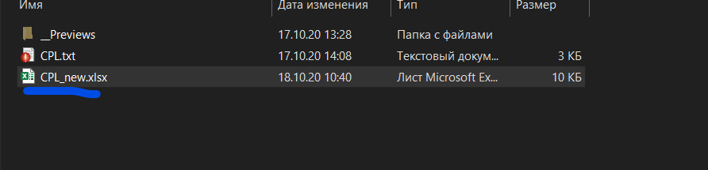
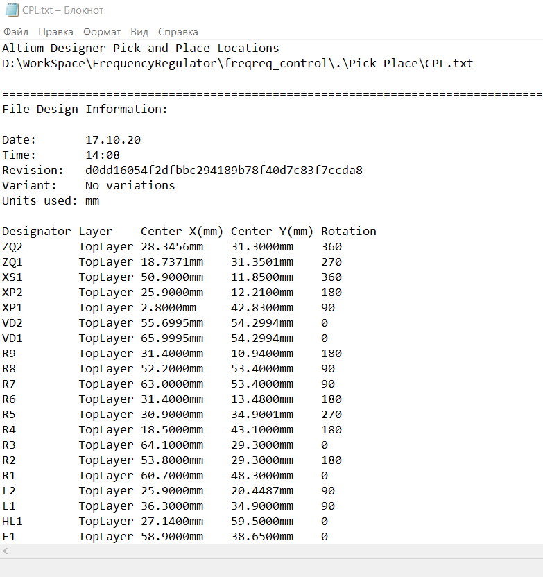
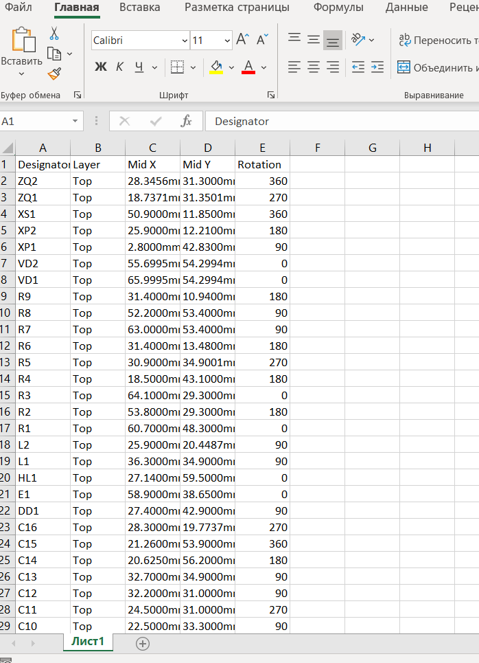

# CPL_Converter
Проект для конвертирования файла pick and place сгенерированным программой ALtium Designer в файл Excel для заказа монтажа печатных плат на сайте JLCPCB.

## Требования

На компьютере должен быть установлен MS Excel.

## Настройка ALtium Designer

Чтобы сгенерировать pick and place файл со стороны Altium Designer необходимо добавить в outputjob файл проекта следующий элемент:

Далее нужно нажать ПКМ на созданный элемент и выбрать пункт Configure:

Затем выполнить настройку элемента как на картинке:

Чтобы выгрузить файл pick and place нужно настроить каталог размещения файла и нажать Run:

## Как использовать программу

### Способ 1. Запуск файла CPL_Converter.exe

После запуска приложения необходимо нажать кнопку "Загрузить файл" затем выбрать pick and place файл сгенерированный программой Altium Designer. После обработки откроется MS Excel с сгенерированными данными, которые затем нужно сохранить.

### Способ 2. Через конекстное меню pick and place файла

Нажать ПКМ на сгенерированный программой Altium Designer pick and place файл и выбрать элемент меню "Открыть с помощью"  затем выбрать программу CPL_Converter:

Обработанный файл будет расположен в том же каталоге, где был входной файл:

## Пример работы программы

Пример входного файла:

Сгенерированный выходной файл:

